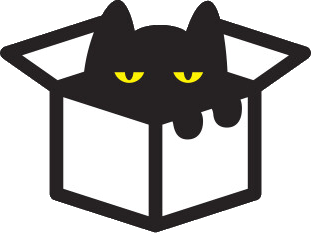

<a name="readme-top"></a>

<!-- PROJECT SHIELDS -->

[![Forks][forks-shield]][forks-url]
[![Stargazers][stars-shield]][stars-url]
[![Issues][issues-shield]][issues-url]
[![LinkedIn][linkedin-shield]][linkedin-url]

<!-- PROJECT LOGO -->
<br />
<div align="center">
  <a href="https://github.com/TheDev-M/catgpt">
    
  </a>

  <h3 align="center">CatGPT</h3>

  <p align="center">
    An interactive virtual pet simulator with AI-powered cat companions!
    <br />
    <a href="https://github.com/TheDev-M/catgpt"><strong>Explore the docs »</strong></a>
    <br />
    <br />
    <a href="https://github.com/TheDev-M/catgpt">View Demo</a>
    ·
    <a href="https://github.com/TheDev-M/catgpt/issues/new?labels=bug&template=bug-report---.md">Report Bug</a>
    ·
    <a href="https://github.com/TheDev-M/catgpt/issues/new?labels=enhancement&template=feature-request---.md">Request Feature</a>
  </p>
</div>

<!-- TABLE OF CONTENTS -->
<details>
  <summary>Table of Contents</summary>
  <ol>
    <li>
      <a href="#about-the-project">About The Project</a>
      <ul>
        <li><a href="#built-with">Built With</a></li>
        <li><a href="#key-features">Key Features</a></li>
      </ul>
    </li>
    <li><a href="#live-demo">Live Demo</a></li>
    <li><a href="#usage">Usage</a></li>
    <li><a href="#project-structure">Project Structure</a></li>
    <li><a href="#roadmap">Roadmap</a></li>
    <li><a href="#contact">Contact</a></li>
    <li><a href="#acknowledgments">Acknowledgments</a></li>
    <li><a href="#local-development-setup">Local Development Setup</a></li>
  </ol>
</details>

<!-- ABOUT THE PROJECT -->

## About The Project

[![CatGPT Screen Shot][product-screenshot]](https://i.imgur.com/qOl223V.png)

CatGPT is an innovative virtual pet simulator that combines the charm of Tamagotchi-style pet care with modern AI chat capabilities. Adopt virtual cats of different breeds, care for them by managing their hunger, mood, and health stats, and engage in conversations powered by AI to create a unique bond with your feline companions.

### Why CatGPT?

- **AI-Powered Interactions**: Chat with your cats using Hugging Face's inference API for realistic, breed-specific conversations
- **Dynamic Pet Care**: Monitor and maintain hunger, mood, and health stats with real-time decay systems
- **Item System**: Collect and use various items (food, toys, hygiene products) that fall from the sky to care for your cats
- **Multiple Breeds**: Adopt cats from different breeds, each with unique temperaments and characteristics
- **Beautiful UI**: Enjoy a responsive, theme-customizable interface with DaisyUI and TailwindCSS
- **Persistent Data**: All your cats and items are saved securely with JWT authentication

Whether you're a cat lover, game enthusiast, or developer exploring full-stack applications, CatGPT offers an engaging experience that showcases modern web development practices.

<p align="right">(<a href="#readme-top">back to top</a>)</p>

### Built With

**Frontend:**

- [![React][React.js]][React-url]
- [![Vite][Vite.js]][Vite-url]
- [![TailwindCSS][TailwindCSS.com]][Tailwind-url]
- [![DaisyUI][DaisyUI.com]][DaisyUI-url]
- [![React Router][ReactRouter.com]][ReactRouter-url]

**Backend:**

- [![Spring Boot][SpringBoot.io]][SpringBoot-url]
- [![Java][Java.com]][Java-url]
- [![PostgreSQL][PostgreSQL.org]][PostgreSQL-url]
- [![JWT][JWT.io]][JWT-url]

**AI Integration:**

- [![Hugging Face][HuggingFace.co]][HuggingFace-url]

<p align="right">(<a href="#readme-top">back to top</a>)</p>

### Key Features

- **Virtual Pet System**: Adopt and care for virtual cats with real-time stat management
- **AI Chat Integration**: Converse with your cats using AI-powered responses tailored to each breed's personality
- **Inventory Management**: Collect items that randomly fall and use them to care for your cats
- **User Authentication**: Secure JWT-based authentication system
- **Multiple Themes**: Customize your experience with various UI themes
- **Cat Collection**: Build your collection by catching different cat breeds
- **Stat Decay System**: Hunger and mood decrease over time, requiring active care
- **Responsive Design**: Seamless experience across desktop and mobile devices

<p align="right">(<a href="#readme-top">back to top</a>)</p>

<!-- LIVE DEMO -->

## Live Demo

Experience CatGPT without any setup:

🌐 **Frontend**: [https://catgpt-demo.netlify.app](https://catgpt-demo.netlify.app)

> **Note**: The backend is hosted on Render's free tier, which means the server goes to sleep after periods of inactivity. The first request may take 1-2 minutes to wake up the server, but subsequent requests will be fast. Please be patient on your first visit!

### Getting Started with the Demo

1. Visit [https://catgpt-demo.netlify.app](https://catgpt-demo.netlify.app)
2. Create a new account on the signup page.
3. A Bob cat is gifted for every new user now!
4. Adopt your first cat and start playing!
5. If the app seems slow initially, wait a few for the server to wake up, then reload the page.

<p align="right">(<a href="#readme-top">back to top</a>)</p>

<!-- USAGE EXAMPLES -->

## Usage

### Creating an Account

1. Navigate to the signup page
2. Enter your username, email, and password
3. Click "Sign Up" to create your account

### Adopting Cats

1. Catch the running nyan-cats.
2. Give your cat a nickname in the popup modal
3. Click "Catch Cat" to adopt a new companion

### Caring for Your Cats

**Monitor Stats:**

- Keep an eye on the status panel showing hunger, mood, and health levels
- Stats decay over time and require attention

**Using Items:**

- Click the inventory button to view your items
- Items fall randomly from the sky - click them to collect
- Select items from your inventory to use them on your cat
- Different items affect different stats:
  - 🍖 Food items restore hunger
  - 🎾 Toys increase mood
  - 🧼 Hygiene products boost health

### Chatting with Your Cat

1. Type your message in the chat interface on the home screen
2. Your cat will respond based on its breed personality
3. Each breed has unique temperaments that influence responses

### Managing Your Collection

- Click "Cat Box" to view all your adopted cats
- Filter cats by breed or select specific ones
- Click on any cat card to view detailed stats
- Select a cat to make it your active companion

<p align="right">(<a href="#readme-top">back to top</a>)</p>

<!-- PROJECT STRUCTURE -->

## Project Structure

```
catgpt/
├── backend/                      # Spring Boot backend
│   ├── src/main/java/com/codecool/catgpt/
│   │   ├── cats/                 # Cat domain, service, repository
│   │   ├── items/                # Item system (food, toys, hygiene)
│   │   ├── users/                # User authentication and management
│   │   ├── security/             # JWT authentication & filters
│   │   └── config/               # Spring configuration
│   └── pom.xml                   # Maven dependencies
│
└── frontend/                     # React + Vite frontend
    ├── src/
    │   ├── components/           # Reusable UI components
    │   │   ├── ChatInterface/    # AI chat components
    │   │   ├── CatBox*/          # Cat collection views
    │   │   ├── Inventory/        # Item management
    │   │   └── Status/           # Stat display components
    │   ├── hooks/                # Custom React hooks
    │   ├── contexts/             # React contexts (Auth, SelectedCat)
    │   ├── services/             # API service layer
    │   └── pages/                # Main page components
    └── package.json              # npm dependencies
```

<p align="right">(<a href="#readme-top">back to top</a>)</p>

<!-- ROADMAP -->

## Roadmap

- [x] Core virtual pet mechanics
- [x] AI-powered chat integration
- [x] User authentication with JWT
- [x] Item collection and usage system
- [x] Multi-cat management
- [x] Real-time stat decay
- [ ] Achievement/badge system
- [ ] Social features (friend list, cat trading)
- [ ] Mini-games for earning items
- [ ] Mobile app (React Native)
- [ ] Notifications for critical stat levels

See the [open issues](https://github.com/TheDev-M/catgpt/issues) for a full list of proposed features and known issues.

<p align="right">(<a href="#readme-top">back to top</a>)</p>

<!-- CONTACT -->

## Contact

Nagy Márton - nagy.marton.2002@gmail.com

Project Link: [https://github.com/TheDev-M/catgpt](https://github.com/TheDev-M/catgpt)

<p align="right">(<a href="#readme-top">back to top</a>)</p>

<!-- ACKNOWLEDGMENTS -->

## Acknowledgments

Resources and libraries that made this project possible:

- [Spring Boot Documentation](https://spring.io/projects/spring-boot)
- [React Documentation](https://react.dev)
- [Hugging Face Inference API](https://huggingface.co/inference-api)
- [The Cat API](https://thecatapi.com) - For cat breed information
- [DaisyUI](https://daisyui.com) - Beautiful UI components
- [TailwindCSS](https://tailwindcss.com)
- [JWT.io](https://jwt.io)
- [React Router](https://reactrouter.com)

<p align="right">(<a href="#readme-top">back to top</a>)</p>

<!-- LOCAL DEVELOPMENT SETUP -->

## Local Development Setup

<details>
  <summary>Click to expand installation instructions</summary>

Want to run CatGPT locally? Follow these instructions.

### Prerequisites

Ensure you have the following installed:

- **Java Development Kit (JDK) 21**

  ```sh
  java --version
  ```

- **Maven 3.8+**

  ```sh
  mvn --version
  ```

- **Node.js 16+**

  ```sh
  node --version
  ```

- **PostgreSQL 14+**

  ```sh
  psql --version
  ```

- **npm**
  ```sh
  npm install npm@latest -g
  ```

### Installation

#### 1. Clone the Repository

```sh
git clone https://github.com/TheDev-M/catgpt.git
cd catgpt
```

#### 2. Set Up the Database

Create a PostgreSQL database:

```sh
createdb catgpt
```

Or using psql:

```sql
CREATE DATABASE catgpt;
```

#### 3. Configure Backend Environment

Navigate to the backend directory and create a `.env` file:

```sh
cd backend
cp .env.example .env
```

Edit `.env` with your configuration:

```env
# Database Configuration
SPRING_DATASOURCE_URL=jdbc:postgresql://localhost:5432/catgpt
SPRING_DATASOURCE_USERNAME=your_db_username
SPRING_DATASOURCE_PASSWORD=your_db_password

# JWT Configuration
JWT_SECRET=your_super_secret_jwt_key_here
JWT_EXPIRATION=3600000

# CatGPT Stats
MAX_HUNGER=10
MAX_MOOD=10
MAX_HEALTH=10
```

#### 4. Install Backend Dependencies and Run

```sh
# Install dependencies and run
./mvnw clean install
./mvnw spring-boot:run
```

The backend will start on `http://localhost:8080`

#### 5. Configure Frontend Environment

In a new terminal, navigate to the frontend directory:

```sh
cd ../frontend
cp .env.example .env
```

Edit the `.env` file with your Hugging Face API token:

```env
VITE_HUGGINGFACE_API_TOKEN=your_huggingface_token_here
```

Get your API token from [Hugging Face](https://huggingface.co/settings/tokens)

#### 6. Install Frontend Dependencies and Run

```sh
npm install
npm run dev
```

The frontend will start on `http://localhost:5173`

#### 7. Access the Application

Open your browser and navigate to:

```
http://localhost:5173
```

Create an account, adopt your first cat, and start your CatGPT journey!

</details>

<p align="right">(<a href="#readme-top">back to top</a>)</p>

<!-- MARKDOWN LINKS & IMAGES -->

[forks-shield]: https://img.shields.io/github/forks/TheDev-M/catgpt.svg?style=for-the-badge
[forks-url]: https://github.com/TheDev-M/catgpt/network/members
[stars-shield]: https://img.shields.io/github/stars/TheDev-M/catgpt.svg?style=for-the-badge
[stars-url]: https://github.com/TheDev-M/catgpt/stargazers
[issues-shield]: https://img.shields.io/github/issues/TheDev-M/catgpt.svg?style=for-the-badge
[issues-url]: https://github.com/TheDev-M/catgpt/issues
[linkedin-shield]: https://img.shields.io/badge/-LinkedIn-black.svg?style=for-the-badge&logo=linkedin&colorB=555
[linkedin-url]: https://linkedin.com/in/yourprofile
[product-screenshot]: https://i.imgur.com/qOl223V.png
[React.js]: https://img.shields.io/badge/React-20232A?style=for-the-badge&logo=react&logoColor=61DAFB
[React-url]: https://reactjs.org/
[Vite.js]: https://img.shields.io/badge/Vite-646CFF?style=for-the-badge&logo=vite&logoColor=white
[Vite-url]: https://vitejs.dev/
[TailwindCSS.com]: https://img.shields.io/badge/Tailwind_CSS-38B2AC?style=for-the-badge&logo=tailwind-css&logoColor=white
[Tailwind-url]: https://tailwindcss.com/
[DaisyUI.com]: https://img.shields.io/badge/DaisyUI-5A0EF8?style=for-the-badge&logo=daisyui&logoColor=white
[DaisyUI-url]: https://daisyui.com/
[ReactRouter.com]: https://img.shields.io/badge/React_Router-CA4245?style=for-the-badge&logo=react-router&logoColor=white
[ReactRouter-url]: https://reactrouter.com/
[SpringBoot.io]: https://img.shields.io/badge/Spring_Boot-6DB33F?style=for-the-badge&logo=spring-boot&logoColor=white
[SpringBoot-url]: https://spring.io/projects/spring-boot
[Java.com]: https://img.shields.io/badge/Java-ED8B00?style=for-the-badge&logo=openjdk&logoColor=white
[Java-url]: https://www.java.com/
[PostgreSQL.org]: https://img.shields.io/badge/PostgreSQL-316192?style=for-the-badge&logo=postgresql&logoColor=white
[PostgreSQL-url]: https://www.postgresql.org/
[JWT.io]: https://img.shields.io/badge/JWT-000000?style=for-the-badge&logo=JSON%20web%20tokens&logoColor=white
[JWT-url]: https://jwt.io/
[HuggingFace.co]: https://img.shields.io/badge/Hugging_Face-FFD21E?style=for-the-badge&logo=huggingface&logoColor=black
[HuggingFace-url]: https://huggingface.co/
