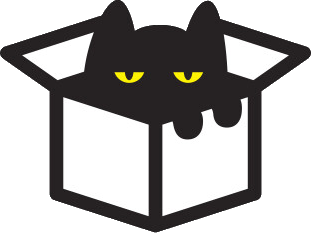

<a name="readme-top"></a>

[![Forks][forks-shield]][forks-url]
[![Stargazers][stars-shield]][stars-url]
[![Issues][issues-shield]][issues-url]
[![LinkedIn][linkedin-shield]][linkedin-url]

<br />
<div align="center">
  <a href="https://github.com/TheDev-M/catgpt">
    
  </a>

  <h3 align="center">CatGPT</h3>

  <p align="center">
    A virtual cat companion with AI-powered conversations, real-time stat management, a collectible item system, and a social friend system with cat borrowing.
    <br />
    <br />
    <a href="https://catgpt-demo.netlify.app">🌐 Live Demo</a>
    ·
    <a href="https://github.com/TheDev-M/catgpt/issues/new?labels=bug">Report Bug</a>
    ·
    <a href="https://github.com/TheDev-M/catgpt/issues/new?labels=enhancement">Request Feature</a>
  </p>
</div>

---

<details>
  <summary>Table of Contents</summary>
  <ol>
    <li><a href="#about-the-project">About The Project</a></li>
    <li><a href="#built-with">Built With</a></li>
    <li><a href="#key-features">Key Features</a></li>
    <li><a href="#live-demo">Live Demo</a></li>
    <li><a href="#usage">Usage</a></li>
    <li><a href="#local-development">Local Development</a></li>
    <li><a href="#docker-setup">Docker Setup</a></li>
    <li><a href="#environment-variables">Environment Variables</a></li>
    <li><a href="#running-tests">Running Tests</a></li>
    <li><a href="#project-structure">Project Structure</a></li>
    <li><a href="#roadmap">Roadmap</a></li>
    <li><a href="#contact">Contact</a></li>
    <li><a href="#acknowledgments">Acknowledgments</a></li>
  </ol>
</details>

---

## About The Project

[![CatGPT Screenshot][product-screenshot]](https://i.imgur.com/qOl223V.png)

CatGPT is a full-stack virtual pet simulator that combines Tamagotchi-style care mechanics with an LLM chat interface. Adopt cats of different breeds, maintain their hunger, mood, and health, collect items that fall from the sky, and have real AI-powered conversations where each cat's personality is shaped by its breed temperament and current stats. Add friends, send and accept friend requests in real time, and borrow each other's cats as your active companion.

The project is built with a Spring Boot REST API, a React + Vite frontend, and a PostgreSQL database, all containerised with Docker Compose for easy local setup or self-hosted deployment.

<p align="right">(<a href="#readme-top">back to top</a>)</p>

---

## Built With

**Frontend**

[![React][React.js]][React-url]
[![Vite][Vite.js]][Vite-url]
[![TailwindCSS][TailwindCSS.com]][Tailwind-url]
[![DaisyUI][DaisyUI.com]][DaisyUI-url]
[![React Router][ReactRouter.com]][ReactRouter-url]

**Backend**

[![Spring Boot][SpringBoot.io]][SpringBoot-url]
[![Java][Java.com]][Java-url]
[![PostgreSQL][PostgreSQL.org]][PostgreSQL-url]
[![JWT][JWT.io]][JWT-url]

**AI & External APIs**

| Service | Purpose |
|---|---|
| [Groq](https://groq.com) — `qwen/qwen3.6-27b` | Powers cat chat responses |
| [The Cat API](https://thecatapi.com) | Breed info and images for new cats |
| Google OAuth 2.0 | Social sign-in |

<p align="right">(<a href="#readme-top">back to top</a>)</p>

---

## Key Features

- **AI Chat** — Each cat responds in character using its breed's temperament. A starving cat refuses to answer questions; a grumpy cat hisses. Powered by Groq's inference API.
- **Stat System** — Hunger decreases on a timer; mood decreases when you chat with your cat; health decreases if you go more than an hour without logging in.
- **Item System** — Items randomly fall onto the screen. Click to catch them; use them from inventory to restore stats. Twelve item templates across food, toys, and hygiene.
- **Cat Collection** — Catch the running nyan-cat to adopt a new breed. Each cat is assigned stats based on the breed's energy, grooming, and health data from The Cat API.
- **Friend System** — Send and receive friend requests by username. Accept or decline via the friend list drawer. Real-time updates via Server-Sent Events — both users see changes instantly without refreshing.
- **Cat Borrowing** — Borrow a friend's cat as your active companion. Owner always has priority: selecting their own cat automatically returns it from any borrower. First-come-first-served among multiple friends. SSE pushes notifications to all affected users in real time.
- **Profile Page** — Set a display name (nickname) shown throughout the app. Change password for local accounts.
- **Google OAuth** — Sign in with Google in addition to email/password.
- **Server Wake-Up Popup** — The backend is hosted on Render's free tier and sleeps when idle. A non-blocking popup appears automatically if the first request takes more than 1.5 s, with a spinner and estimated wait time.
- **Multiple Themes** — Five DaisyUI themes switchable via the theme picker: Valentine (default), Caramellatte, Synthwave, Autumn, Abyss.
- **Responsive** — Works on mobile and desktop.

<p align="right">(<a href="#readme-top">back to top</a>)</p>

---

## Live Demo

🌐 **[https://catgpt-demo.netlify.app](https://catgpt-demo.netlify.app)**

> The backend runs on Render's free tier and sleeps after inactivity. The app will automatically show a wakeup popup on your first visit — the server usually responds within 30–60 seconds.

### Getting Started

1. Visit the link above
2. Sign up with email/password or **Continue with Google**
3. You're gifted a starter cat named Bob
4. Catch the running cat on the home screen to adopt more breeds

<p align="right">(<a href="#readme-top">back to top</a>)</p>

---

## Usage

### Adopting a Cat

1. On the home screen, wait for the running nyan-cat to appear
2. Click it to open the adoption popup
3. Give your cat a nickname and click **Catch Cat**

### Caring for Your Cat

- Watch the **Status Panel** (top-left) for hunger, mood, and health bars
- **Hunger** drops every minute — feed your cat from inventory
- **Mood** drops each time you send a chat message — use toys
- **Health** drops if you haven't logged in for over an hour — use hygiene items
- Items randomly fall from the sky — click them before they disappear to collect

### Chatting

Type anything in the chat box. Responses vary by breed temperament and current stats:
- Hungry cats beg for food instead of answering
- Grumpy cats give short, snarky replies
- Happy cats are affectionate and chatty

### Managing Your Collection

- **Cat Box** (bottom-right) — browse all your cats, filter by name or breed
- Click a cat card to open its detail page — rename, select as active, or release
- Select a cat to make it your active companion on the home screen

### Friends & Cat Borrowing

- Open the **Friend List** drawer (bottom-right, next to Cat Box) to manage your social connections
- Type a friend's username in the input field and click **Add** to send a request
- Switch to the **Requests** tab to accept or decline incoming requests
- On the **Friends** tab, click 🐱 on any friend to see their cats
- Click **Borrow** to make a friend's cat your active companion — a "Borrowing" strip appears at the top of the drawer with a **Return** button
- The owner can reclaim their cat at any time by selecting it in their own Cat Box

### Profile

- Click **Profile** (top-right) to open your profile page
- Set a display name that appears in place of your username throughout the app
- Change your password (local accounts only — Google accounts show a locked state)

<p align="right">(<a href="#readme-top">back to top</a>)</p>

---

## Local Development

### Prerequisites

- Java 21+
- Node.js 18+
- PostgreSQL 16 (or Docker)

### Backend

```bash
cd backend

# Copy and fill in environment variables
cp .env.example .env

# Run (Spring profile defaults to 'dev')
./mvnw spring-boot:run
```

The API starts at `http://localhost:8080`.

### Frontend

```bash
cd frontend

# Copy and fill in environment variables
cp .env.example .env
# Set VITE_API_BASE_URL=http://localhost:8080

npm install
npm run dev
```

The app opens at `http://localhost:5173`.

<p align="right">(<a href="#readme-top">back to top</a>)</p>

---

## Docker Setup

Starts all three services (frontend, backend, database) with a single command.

```bash
# 1. Clone
git clone https://github.com/TheDev-M/catgpt.git
cd catgpt

# 2. Configure
cp .env.example .env   # edit as needed (see Environment Variables below)

# 3. Start
docker compose up -d
```

Open **http://localhost:3000**.

### Common Commands

```bash
docker compose logs -f          # stream logs
docker compose down             # stop
docker compose up -d --build    # rebuild after code changes
docker compose down -v          # full reset (deletes database volume)
```

### Architecture

```
Browser → Nginx :3000 → Spring Boot :8080 → PostgreSQL :5432
```

Nginx proxies `/api/*` to the backend, so there are no CORS issues in the Docker setup.

<p align="right">(<a href="#readme-top">back to top</a>)</p>

---

## Environment Variables

### Backend (`backend/.env`)

| Variable | Required | Description |
|---|---|---|
| `SPRING_DATASOURCE_URL` | ✅ | JDBC URL, e.g. `jdbc:postgresql://localhost:5432/catgpt` |
| `SPRING_DATASOURCE_USERNAME` | ✅ | Database user |
| `SPRING_DATASOURCE_PASSWORD` | ✅ | Database password |
| `JWT_SECRET` | ✅ | HS256 signing key — **minimum 32 characters** |
| `JWT_EXPIRATION` | | Token lifetime in ms (default `3600000` = 1 h) |
| `GROQ_API_KEY` | ✅ | API key from [console.groq.com](https://console.groq.com) |
| `GOOGLE_CLIENT_ID` | | Google OAuth client ID (OAuth login disabled without it) |
| `GOOGLE_CLIENT_SECRET` | | Google OAuth client secret |
| `FRONTEND_URL` | ✅ | Frontend origin used for OAuth redirect, e.g. `http://localhost:5173` |
| `THE_CAT_API_KEY` | | Optional — raises The Cat API rate limits |

### Frontend (`frontend/.env`)

| Variable | Required | Description |
|---|---|---|
| `VITE_API_BASE_URL` | ✅ | Backend URL. Use `PROXY` when running via Docker (Nginx proxy). Use `http://localhost:8080` for local dev. |
| `VITE_RUN_DURATION_MS` | | How long the running cat is visible (default `4000`) |
| `VITE_RUN_MIN_INTERVAL_MS` | | Min wait between running cat appearances (default `120000`) |
| `VITE_RUN_MAX_INTERVAL_MS` | | Max wait between running cat appearances (default `300000`) |
| `VITE_FALL_DURATION_MS` | | How long items fall before disappearing (default `5000`) |
| `VITE_FALL_MIN_INTERVAL_MS` | | Min wait between item drops (default `10000`) |
| `VITE_FALL_MAX_INTERVAL_MS` | | Max wait between item drops (default `20000`) |
| `VITE_HUNGER_INTERVAL_MS` | | Hunger decay interval in ms (default `60000`) |

<p align="right">(<a href="#readme-top">back to top</a>)</p>

---

## Running Tests

The backend has 140 unit tests covering services, controllers, domain logic, security, and validation.

```bash
cd backend
./mvnw test
```

Test coverage includes:

| Layer | What's tested |
|---|---|
| `CatService` | create, get, delete, rename, applyItem, decrementStat, default cat creation |
| `ItemService` | getAllForOwner, create, catchItemForUser, getOwnedItem (ownership + 404) |
| `UserService` | register, authenticate, OAuth login, visit recording, health decrement on login, nickname + password update |
| `FriendService` | send/approve/decline/remove friendships, conflict and ownership checks |
| `JwtService` | generate, extract, valid/expired/tampered/garbage token, short-secret guard |
| `CurrentUser` | resolves user from security context, returns null without auth |
| `GlobalExceptionHandler` | all handled exception types produce correct status and body |
| `Stats` domain | apply/decrement for each stat type, floor/cap clamping |
| `Item` domain | increaseOne, consumeOne, out-of-stock guard |
| `ItemTemplate` | fromName (case-insensitive, null, unknown), createOwnedItem |
| DTO validation | `UserRegisterRequest`, `CatRenameRequest`, `SourceMetrics`, `ChangePasswordRequest`, `FriendRequestDto` — `@NotBlank`/`@Min`/`@Max`/`@Size` |

<p align="right">(<a href="#readme-top">back to top</a>)</p>

---

## Project Structure

```
catgpt/
├── backend/
│   └── src/main/java/com/codecool/catgpt/
│       ├── cats/           # Cat entity, service, repository, DTOs
│       │   ├── api/        # CatController + request/response DTOs
│       │   ├── app/        # CatService, StatsCalculator
│       │   ├── domain/     # Cat, Stats (JPA entities)
│       │   └── infra/      # CatRepository
│       ├── items/          # Item system (food, toys, hygiene)
│       │   ├── api/        # ItemController + DTOs
│       │   ├── app/        # ItemService
│       │   ├── domain/     # Item, ItemTemplate, Effect, StatType
│       │   └── infra/      # ItemRepository
│       ├── users/          # User registration, login, profile
│       │   ├── api/        # UserController, UserProfileController + DTOs
│       │   ├── app/        # UserService
│       │   ├── domain/     # User, AuthProvider
│       │   └── infra/      # UserRepository
│       ├── friends/        # Friend requests and relationships
│       │   ├── api/        # FriendController + DTOs
│       │   ├── app/        # FriendService
│       │   └── domain/     # Friendship, FriendshipStatus, FriendshipRepository
│       ├── borrow/         # Cat borrowing between friends
│       │   ├── api/        # BorrowController + BorrowableCatResponse DTO
│       │   └── app/        # BorrowService
│       ├── sse/            # Server-Sent Events push notifications
│       │   ├── SseService  # Per-user emitter registry
│       │   └── SseController
│       ├── chat/           # AI chat via Groq API
│       ├── breeds/         # Breed data from The Cat API
│       ├── security/       # JWT, filters, OAuth handlers, AppUserDetails
│       ├── config/         # SecurityConfig, CorsConfig, StatsConfig, AppConfig
│       └── common/         # BaseEntity, StatsLimits, GlobalExceptionHandler, ErrorResponse
│
└── frontend/
    └── src/
        ├── components/     # UI components (ChatInterface, Inventory, Status, …)
        ├── hooks/          # Custom React hooks (useCat, useInventory, useServerWakeup, …)
        ├── contexts/       # AuthContext, SelectedCatContext
        ├── services/       # API clients (apiClient, catApi, itemsApi, userApi, friendApi, borrowApi)
        ├── pages/          # HomePage, CatBoxPage, CatDetailsPage, LoginPage, SignupPage, ProfilePage
        ├── constants/      # Item definitions, themes, cat thinking phrases
        ├── config/         # gameConfig (timers and intervals)
        └── utils/          # validation, sorting, random, theme helpers
```

<p align="right">(<a href="#readme-top">back to top</a>)</p>

---

## Roadmap

- [x] Core virtual pet mechanics (hunger, mood, health)
- [x] AI-powered chat (Groq / qwen3.6-27b)
- [x] JWT authentication + Google OAuth
- [x] Item collection and inventory system
- [x] Multi-cat management and cat box
- [x] Real-time stat decay
- [x] Server wake-up popup (Render free tier)
- [x] Full backend unit test suite (140 tests)
- [x] Profile page (display name + password change)
- [x] Friend system (send/accept/decline requests, real-time SSE updates)
- [x] Cat borrowing (borrow a friend's cat as active companion, owner priority, SSE notifications)
- [ ] Achievement / badge system
- [ ] Cat trading
- [ ] Mini-games for earning items
- [ ] Push notifications for critical stat levels
- [ ] Mobile app (React Native)

See the [open issues](https://github.com/TheDev-M/catgpt/issues) for a full list of proposed features and known bugs.

<p align="right">(<a href="#readme-top">back to top</a>)</p>

---

## Contact

Nagy Márton — nagy.marton.2002@gmail.com

Project: [https://github.com/TheDev-M/catgpt](https://github.com/TheDev-M/catgpt)

<p align="right">(<a href="#readme-top">back to top</a>)</p>

---

## Acknowledgments

- [Spring Boot](https://spring.io/projects/spring-boot)
- [React](https://react.dev)
- [Groq](https://groq.com) — fast LLM inference
- [The Cat API](https://thecatapi.com) — breed data and images
- [DaisyUI](https://daisyui.com) — UI components
- [TailwindCSS](https://tailwindcss.com)
- [JJWT](https://github.com/jwtk/jjwt) — JWT library for Java
- [React Router](https://reactrouter.com)

<p align="right">(<a href="#readme-top">back to top</a>)</p>

---

<!-- Shields -->
[forks-shield]: https://img.shields.io/github/forks/TheDev-M/catgpt.svg?style=for-the-badge
[forks-url]: https://github.com/TheDev-M/catgpt/network/members
[stars-shield]: https://img.shields.io/github/stars/TheDev-M/catgpt.svg?style=for-the-badge
[stars-url]: https://github.com/TheDev-M/catgpt/stargazers
[issues-shield]: https://img.shields.io/github/issues/TheDev-M/catgpt.svg?style=for-the-badge
[issues-url]: https://github.com/TheDev-M/catgpt/issues
[linkedin-shield]: https://img.shields.io/badge/-LinkedIn-black.svg?style=for-the-badge&logo=linkedin&colorB=555
[linkedin-url]: https://linkedin.com/in/yourprofile
[product-screenshot]: https://i.imgur.com/qOl223V.png

<!-- Tech badges -->
[React.js]: https://img.shields.io/badge/React-20232A?style=for-the-badge&logo=react&logoColor=61DAFB
[React-url]: https://reactjs.org/
[Vite.js]: https://img.shields.io/badge/Vite-646CFF?style=for-the-badge&logo=vite&logoColor=white
[Vite-url]: https://vitejs.dev/
[TailwindCSS.com]: https://img.shields.io/badge/Tailwind_CSS-38B2AC?style=for-the-badge&logo=tailwind-css&logoColor=white
[Tailwind-url]: https://tailwindcss.com/
[DaisyUI.com]: https://img.shields.io/badge/DaisyUI-5A0EF8?style=for-the-badge&logo=daisyui&logoColor=white
[DaisyUI-url]: https://daisyui.com/
[ReactRouter.com]: https://img.shields.io/badge/React_Router-CA4245?style=for-the-badge&logo=react-router&logoColor=white
[ReactRouter-url]: https://reactrouter.com/
[SpringBoot.io]: https://img.shields.io/badge/Spring_Boot-6DB33F?style=for-the-badge&logo=spring-boot&logoColor=white
[SpringBoot-url]: https://spring.io/projects/spring-boot
[Java.com]: https://img.shields.io/badge/Java_21-ED8B00?style=for-the-badge&logo=openjdk&logoColor=white
[Java-url]: https://www.java.com/
[PostgreSQL.org]: https://img.shields.io/badge/PostgreSQL-316192?style=for-the-badge&logo=postgresql&logoColor=white
[PostgreSQL-url]: https://www.postgresql.org/
[JWT.io]: https://img.shields.io/badge/JWT-000000?style=for-the-badge&logo=JSON%20web%20tokens&logoColor=white
[JWT-url]: https://jwt.io/
